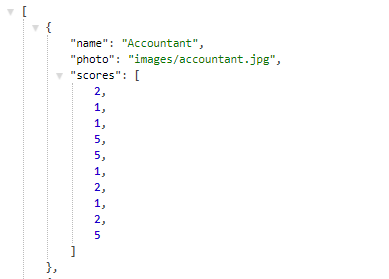

# Career Finder

### Overview

This app is a career finder. This full-stack site takes in results from the users' surveys, and compares their answers with those for different professions. The app then displays the name and picture of the career with the best overall match. 

The app uses Express to handle routing. The app is deployed on Heroku: https://secret-coast-91138.herokuapp.com/

### Node Packages
 This app uses path, express, and body-parser node packages (see package.json).

### Instructions

1. The survey has 10 questions. Each answer is on a scale of 1 to 5 based on how much the user agrees or disagrees with the question.

2. `htmlRoutes.js` file includes two routes:

   * A GET Route to `/survey` which displays the survey page.
   * A default, catch-all route that leads to `home.html` which displays the home page. 

   

3. `apiRoutes.js` file contains two routes:

   * A GET route with the url `/api/careers`. This is used to display a JSON of all possible careers.
   * A POST routes `/api/careers`. This is used to handle incoming survey results. This route is also used to handle the compatibility logic. 

4. The  application's data inside of `app/data/careers.js` as an array of objects. 

5. The user's most compatible career is determined by:

   * Converting each user's results into a simple array of numbers (ex: `[5, 1, 4, 4, 5, 1, 2, 5, 4, 1]`).
   * Comparing the difference between current user's scores and those from the stored careers, question by question. Adding up the differences to calculate the `totalDifference`.
     * Example: 
       * User: `[5, 1, 4, 4, 5, 1, 2, 5, 4, 1]`
       * Career: `[3, 2, 6, 4, 5, 1, 2, 5, 4, 1]`
       * Total Difference: **2 + 1 + 2 =** **_5_**
   * The absolute value of the differences are used. 
   * The closest match will be the career with the least amount of difference.

6. Once the current user's most compatible career is found, the result is displayed as a modal pop-up.
   * The modal displays both the name and picture of the closest career match. 

